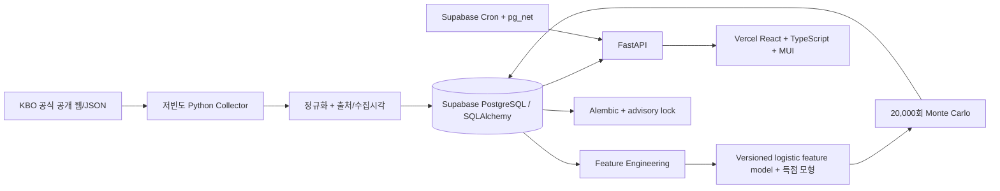
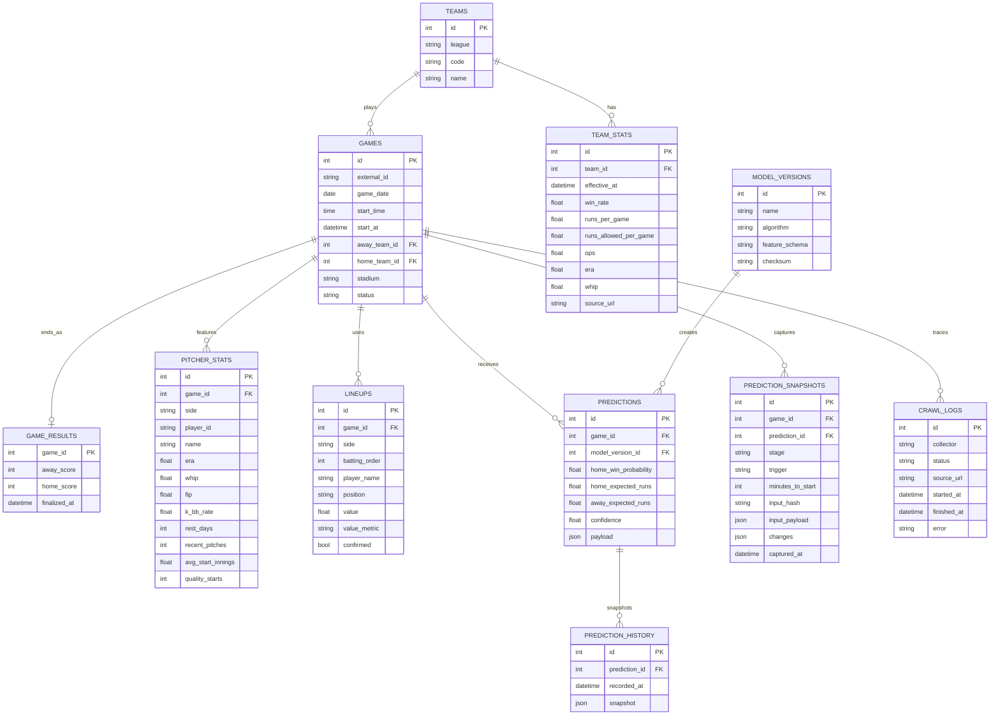

# KBO / MLB AI 승부예측 플랫폼 설계

문서 기준일: 2026-08-22 (Asia/Seoul)  
현재 구현 범위: KBO + MLB, 상시 운영·선발/라인업 변경 감지·시점별 스냅샷·walk-forward 평가

## 1. 최종 Architecture

- Vercel Python Function에 Collector, 예측 엔진, API를 두고 Supabase Cron이 인증 호출한다.
- Redis, Celery, GPU, Prediction microservice, LLM을 사용하지 않는다.
- 원본 출처와 `collected_at`을 모든 통계 스냅샷에 남긴다.
- 수집 실패 시 마지막 정상 캐시를 사용하고 신뢰도를 낮춘다.
- 배포 DB는 Supabase PostgreSQL, 로컬 개발 DB는 SQLite를 사용한다.

## 2. 무료 데이터 Source 후보

| 우선순위 | Source | 판정 | 용도 |
|---|---|---|---|
| 1 | KBO 공식 경기일정/게임센터 공개 JSON | Phase 1 채택 | 일정, 구장, 상태, 스코어, 확정 선발 ID/이름 |
| 1 | KBO 공식 기록실 HTML | Phase 1 채택 | 순위, 홈/원정, 최근 10경기 요약, 팀 타격/투수 기록 |
| 1 | KBO 공식 선발투수·라인업 비교 JSON | 채택 | ERA, WHIP, WAR, 경기수, 평균 선발이닝, QS, 타순·WAR |
| 2 | KBO 월간 일정 공개 JSON | Phase 1 채택 | 과거 결과와 최근 5/10/20경기 직접 계산 |
| 1 | MLB 공식 Stats API / Gameday feed | 채택 | 일정, KST 시각, 팀 기록, probable pitcher, 실제 타순, 선수 OPS, 결과 |
| 2 | 기상청 단기예보 | Phase 2 후보 | 실외구장 날씨. 격자·발표시각 처리 비용 때문에 제외 |
| 3 | 무료 비공식 사이트 | 보류 | 공식 소스 결손 시에만 검토. 약관·스키마 안정성 위험 |

검증된 공식 경로:

- `POST /ws/Main.asmx/GetKboGameList`
- `POST /ws/Schedule.asmx/GetScheduleList`
- `POST /ws/Schedule.asmx/GetPitcherRecordAnalysis`
- `POST /ws/Schedule.asmx/GetLineUpAnalysis`
- `/Record/TeamRank/TeamRank.aspx`
- `/Record/Team/Hitter/Basic1.aspx`, `Basic2.aspx`
- `/Record/Team/Pitcher/Basic1.aspx`
- `https://statsapi.mlb.com/api/v1/schedule`
- `https://statsapi.mlb.com/api/v1/standings`
- `https://statsapi.mlb.com/api/v1/teams/{id}/stats`
- `https://statsapi.mlb.com/api/v1/people/{id}/stats`
- `https://statsapi.mlb.com/api/v1.1/game/{gamePk}/feed/live`

공개 화면이 내부적으로 호출하는 경로이므로 호출 빈도를 낮추고 DB 캐시를 우선한다. 서비스 공개 전 KBO 이용정책과 robots 정책을 다시 검토한다.

## 3. Source별 확보 데이터

- Game list: 리그, 날짜/시간, 원정/홈, 구장, 경기 상태, 점수, 선발 이름/ID, 라인업 공개 여부.
- Schedule list: 월별 경기와 종료 스코어. 최근 5/10/20 승률·득점·실점 계산에 사용.
- Team rank: 승/패/무, 승률, 최근 10경기 표기, 홈/방문 전적.
- Team hitter: 경기, 득점, AVG, HR, BB, SO, OBP, SLG, OPS.
- Team pitcher: ERA, WHIP, 피홈런, 볼넷, 탈삼진, 실점/자책점.
- Starter analysis: ERA, WHIP, WAR, 경기, 평균 선발이닝, QS.
- KBO lineup analysis: 실제/최근 라인업 여부, 타순, 포지션, 선수, WAR.
- MLB schedule/stats/feed: 30개 팀 시즌 기록, probable starter, 실제 타순, 선수 season OPS.

## 4. 크롤링 구분

- 크롤링 불필요(JSON): 경기/일정/선발 비교. 공개 JSON 응답을 직접 정규화한다.
- 최소 HTML 파싱 필요: 팀 순위, 팀 타격, 팀 투수. HTML의 표 헤더와 `data-id`를 기준으로 파싱한다.
- 현재 제외: 실제 불펜 엔트리, 날씨, 시장 배당, 부상자, 타자 좌우 split, 이동 거리, park factor 실측 자동 갱신.
- 불펜은 팀 ERA·선발 평균이닝·선발 최근 5일 투구 수로 만든 명시적 proxy만 사용한다.
- 구장 계수는 보수적 고정값을 사용하며 모델 버전에 포함한다. 모두 1.00에 가깝게 shrink하여 과대반영을 피한다.

## 5. SQLite ERD

동일 팀 통계는 `team_id + effective_at`, 동일 게임 예측은 변경 이력 보존을 위해 append-only history로 기록한다.

## 6. Feature 목록

- `season_win_rate_diff`, `recent_5/10/20_win_rate_diff`, 최근 득점·실점 차이
- `runs_per_game_diff`, `runs_allowed_per_game_diff`, `ops_diff`
- `home_home_win_rate - away_away_win_rate`
- `starter_era_diff`, `starter_whip_diff`, `starter_war_diff`, MLB FIP·K-BB%, 선발 평균이닝·QS율·휴식일·최근 5일 투구 부담 차이
- 팀 휴식일, 동일 날짜 경기 수 기반 더블헤더 조건, 팀 ERA/선발 소화 이닝 기반 불펜 부담 proxy
- `lineup_strength_diff`, 양 팀 실제 라인업 확정 플래그
- 홈 어드밴티지, shrink된 구장 득점계수
- 결측 플래그: 선발 미확정, 최근 표본 부족, 오래된 캐시, 수집 실패

Raw 수치보다 홈 기준 차이값을 우선하고, 미래 경기 결과나 경기 후 데이터는 사용하지 않는다.

## 7. Prediction Algorithm

현재는 학습 데이터가 쌓이기 전의 투명한 `KBO_ENHANCED_V4`와 `MLB_ENHANCED_V3`다. 기존 baseline은 DB에서 과거 모델 버전으로 보존된다.

1. 시즌 승률을 log-odds로 바꾸어 상대 차이를 만든다.
2. 최근 폼, OPS, 득실점, 선발 ERA/WHIP/FIP/K-BB%, 휴식·부담 차이를 작은 사전 계수로 보정한다.
3. 홈 어드밴티지를 더해 logistic 승률을 계산한다.
4. 기대득점은 리그 평균 득점에 공격력·상대 실점 억제력·선발·구장·홈 효과를 곱해 계산한다.
5. Logistic 확률과 득점 시뮬레이션 승률을 혼합한다.
6. 실제 라인업 발표 후 KBO WAR 또는 MLB OPS 차이를 shrink하여 반영하고 새 input hash로 예측을 보존한다.

계수는 훈련된 것처럼 포장하지 않는다. 결과 DB가 충분히 쌓이면 시간순 walk-forward 학습으로 실제 Logistic Regression 계수를 교체하고 model version을 올린다.

백테스트는 경기별 마지막 사전 예측 하나만 선택하고, 확률 보정은 앞선 경기만 사용하는 expanding Platt 방식이다. 최소 30경기 전에는 원 확률을 유지하며 expanding home-rate 기준 모델과 Brier/Log Loss를 비교한다.

## 8. Monte Carlo Algorithm

- 홈/원정 기대득점을 0.6~10.0으로 제한한다.
- 독립 Poisson 분포에서 기본 20,000회 스코어를 생성한다.
- 무승부는 양 팀 승률에 0.5씩 배분해 카드의 승률 합을 100%로 만든다. 무승부 확률도 상세 payload에 별도 제공한다.
- `home -1.5`, `away +1.5`, 7.5/8.5/9.5 O/U, 최빈 스코어, 총점 분위수를 계산한다.
- `game_id + model_version` 해시 seed를 사용해 동일 입력의 결과를 재현한다.

## 9. API 목록

| Method | Path | 설명 |
|---|---|---|
| GET | `/health` | DB와 서비스 상태 |
| GET | `/ready` | 수집 신선도를 포함한 readiness |
| GET | `/api/v1/operations/status` | 최근 수집, 실패율, 변경 알림, 저장 예측 |
| GET | `/api/v1/games?date=YYYY-MM-DD&league=ALL` | 날짜별 KBO/MLB 예측 카드 |
| GET | `/api/v1/games/{external_id}` | 경기 상세, 근거, 분포, 출처 |
| GET | `/api/v1/model/metrics` | 종료 경기 기반 Accuracy/Brier/LogLoss/MAE/RMSE, calibration bins |
| GET | `/api/v1/model/backtest` | 리그·시점별 walk-forward 평가와 모델 leaderboard |
| POST | `/api/v1/admin/refresh?date=...` | 수동 갱신. `ADMIN_TOKEN` 설정 시 헤더 인증 |
| POST | `/api/v1/admin/backup` | 일관된 SQLite online backup |

## 10. Frontend 페이지

- `/`: 날짜 선택, 전체/KBO 필터, 갱신 시각, 경기 카드.
- `/games/:id`: 승률, 기대득점, 선발, 공격, 최근 폼, 핸디캡/O-U, 스코어 분포, 규칙 기반 근거, 출처.
- `/performance`: 누적 평가 지표와 calibration. 표본이 작을 때 명시적으로 안내.
- 현재 UI는 메인과 카드 내 확장 상세를 한 화면에 제공해 라우팅 복잡도를 줄인다.

## 11. Scheduler

Asia/Seoul 기준 반복 배치와 경기별 동적 job을 함께 사용한다:

- 스케줄러 시작 시각 기준 매 1시간 KBO·MLB 당일 일정·선발·라인업 재확인 및 예측 재계산
- 00:20 MLB 다음 날 일정, 13:10 KBO 다음 날 일정 선취득
- 경기 시작 24시간 / 3시간 / 60분 / 15분 전 해당 경기 선발·라인업 재확인과 스냅샷
- 경기 근처 3시간 동안 30분 간격 안전망 갱신
- 경기 시작 4시간 후 결과 재확인
- 03:30 SQLite online backup 및 보존기간 정리

각 job은 upsert, 리그별 freshness check, input hash로 중복 요청과 중복 예측 저장을 억제한다. 매시간 계산하더라도 입력이 같으면 예측을 중복 저장하지 않고, 입력이 바뀐 경우에만 새 예측과 변경 이유를 남긴다.

## 12. 예상 운영비

- 프론트 정적 호스팅: 무료 범위
- FastAPI + Scheduler + SQLite: 개인 PC/NAS 또는 무료/저가 CPU 인스턴스
- 데이터: 공식 공개 정보, API 요금 0원
- LLM/GPU/Redis: 사용 안 함
- 기본 목표: 월 0원. 상시 서버가 필요하면 소형 VPS 비용만 발생

무료 호스팅 정책은 자주 바뀌므로 실제 배포 시점에 다시 확인한다.

## 13. MVP 구현 순서

1. KBO schedule/game/stats collector와 source trace
2. SQLite/SQLAlchemy schema 및 idempotent upsert
3. 최근 폼·차이값 feature
4. baseline Logistic + 기대득점
5. Monte Carlo와 신뢰도/설명
6. FastAPI 조회·수동 refresh
7. React 카드/상세 UI
8. Supabase Cron + pg_net 인증 호출
9. 실제 당일 데이터 E2E 검증
10. leakage-free walk-forward backtest와 calibration dashboard
11. Vercel API, PostgreSQL advisory lock, health/readiness, CI

## 정확도와 한계

- 현재는 시장 배당·부상·상세 불펜 피로도·날씨를 사용하지 않아 신뢰도를 94점으로 상한 처리한다.
- 현재 시즌 팀 통계는 라이브 예측용이다. 과거 백테스트에 현재 시즌 누적값을 재사용하면 leakage이므로, 일자별 스냅샷이 충분히 축적되기 전에는 정식 백테스트 수치를 표시하지 않는다.
- 확률은 모델 추정이며 수익 가능성을 의미하지 않는다.
